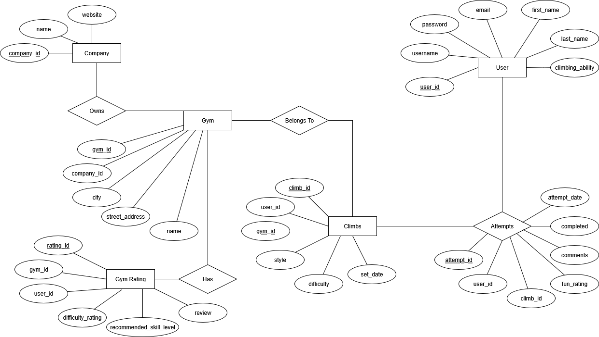

# Climbing Progression Tracker

This project is a relational database app which tracks user progression of bouldering across a variety of Climbing Gyms.

## Purpose of the Project

This project is created as an assessment for unit DEV1002 of CoderAcademy's FullStack Web Development Boot Camp course.

It is intended to allow users to track progression of their climbing, as well as add comments and a fun rating to each climb.

### Description

**Primary function:**
An app for climbers to check their own progress across multiple gyms. 

**Secondary function:**
Allows users to give gyms ratings, and all visitors to check listed gym's difficulty/skill level. 

**User Stories:**
A *climber* wants to *mark which climbs they have attempted at which gyms, mark it as completed when completed, and check their progression over time so they can keep a record of climbs they have completed, and their comments/reflections on difficult problems* to *track their progression over time*.

A *beginner climber* wants to *check the difficulty rating of gyms*,  to *pick a beginner friendly gym, and track their progress to see if they improve over time*.

### Functionality

**CRUD Operations**
Users of the API will be able to:

**Create:**
Add gym ratings for each gym
Add climbs as they are set
Add attempts when attempting climbs at gyms
Create user profile with unique email, username, with password login

**Read:**
Selected queries for individual gyms, gym ratings, locations, companies
Aggregate functions for overall gym ratings and checking climbing progression

**Update:**
Update attempt progression and comments
Update user attributes
Update gym rating and review

**Delete:**
Delete their own user profile and all associated relationships
Delete attempts
Delete gym rating

### User Access

Users will create climbs and only be able to view their own climbs, but all data will be held online. At a later date if this app become more widely used, I would initiate admins to create and standardise climbs and difficulties across multiple gyms, but as most gyms in Australia don't follow any standardised difficulty levels this is not applicable at this stage.

Anyone who accesses the site can see gyms and all related entities.

## Diagrams

The data for this project is presented in a non-normalised format below:

Here is the plan with entities, attributes, relationships.

Here is an ERD with cardinality included for all tables.

## Chosen Database System

### Database Decision

**Structured Relationships:**

Pictured in my ERD are the below relationships:

- Company connects to Gym
- Gym connects to Climbs and Gym_Ratings
- Users connects to Attempts, Gym_Ratings, and Climbs
- Climbs connects to Attempts

As I have many related tables to consider in this project, with the User and Gym entities being closely related to multiple other entities, the clearly structured nature of a Relational Database is ideal to ensure the data integrity of these related tables. All connections must be Valid, for example an Attempt cannot exist without a User or Climb. This also protects the database from orphaned records, as upon deleting a Gym, all associated Climbs will be deleted.

In addition, my database uses enumerated data (ENUM) and validation checks which are natively enforced in a relational database.

At the current scale of the project (where I expect a number in the realm of thousands of records), a relational database system with strong ACID compliance is ideal. All attempts and ratings are atomic (all or nothing), so if at any point a server crash occurs, there will be no partial records which could threaten the integrity of the database.

SQL queries for this database are lightweight, able to be enacted using simple joins.

A feature of the app is to allow users to ONLY view their own climbs. Native support for UNIQUE constraints, ACID protection of password and username creation, and strict schema validations (such as for password hash length) is a benefit for creating authorisations.

Relational databases are more easily integrated with other tools to auto-hash passwords.

In future if the scale of the app continues to grow, the addition of roles such as admin/owner are more easy to create and manage.

**Why not NoSQL?:**
A non-relational database would be more appropriate if I required horizontal scalability (was expecting a high number of records in the millions), or if the data being stored was arbitrary or unstructured.

Validation and simple relationships in a NoSQL database require a much larger codebase, and add a lot of unnecessary work. For ENUM and CHECK constraints, a lot of application side checks and extra code would be required to achieve the same level of validation. This means unless you take extra steps with extra code, users can enter incorrect data which would affect any visitors to the site looking for objective data.

Querying data based on the relationships described in my ERD would involve much more complicated queries, which presents more risk for error on the application side.

NoSQL Databases do not enforce foreign key cascading natively, meaning upon deletion of records, querying a non-existant record can lead to errors.

In future a hybrid format including Non-Relational Database systems for Climbs and Attempts could be cool, especially if I wanted to include the ability to post a photo of a climb, or other types of but for the beginning of this app I will focus purely on Relational Databases.

### Database Management System

I will be using the PostgreSQL as my DMS for this project, and SQLite for any error testing, as I am studying this in my CoderAcademy course, and have used SQLite for error testing in my classwork.

I will compare the strengths and weaknesses of PostgreSQL and MySQL below in the context of my project, as well as describing the strengths and weaknesses of SQLite.

**PostgreSQL Strengths:**

- Allows use of JSON, custom data types and advanced joins
- Supports and encourages strict data integrity, especially useful for ENUM and foreign key data
- More scalable than MySQL for heavy record loads
- Always rejects invalid data, and will log errors when invalid data occurs

**PostgreSQL Weaknesses:**

- Harder to setup than SQLite

**MySQL Strengths:**

- Great for simple web apps with fast read requirements
- Faster for read-heavy loads, though due to the scale of the project this is neglible
- Easier setup

**MySQL Weaknesses:**

- Less strict data validation by default, and does not warn when invalid data is entered.
  - Example:
    - username is valid if 32 or below characters.
    - user enters a username of 50 characters
    - MySQL will truncate the data to 32 characters but not flag this by default
    - user now has a username which no longer matches their entry
    - no error is logged by default, so fixing corrupt or invalid data is more difficult

**SQLite Strengths:**

- Best for tiny apps with low or no network traffic
- No setup or server requirements
- Great for testing due to its discrete nature

**SQLite Weaknesses:**

- No user authentication or built in user management
- No concurrent data writing will cause failures if multiple users edit data at once